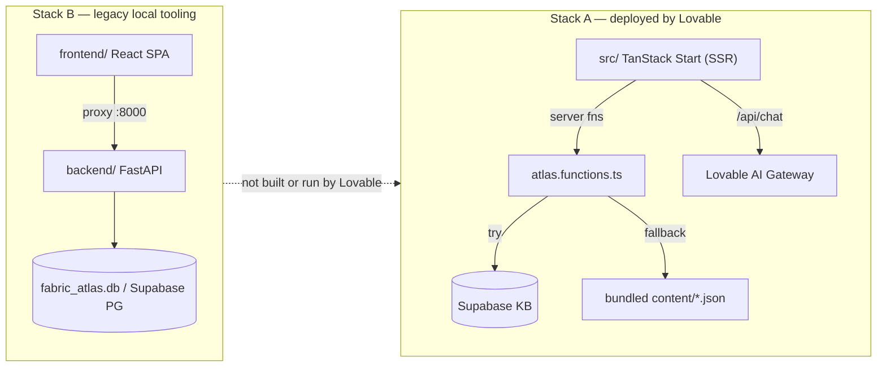

# Fabric Atlas — Deployment Analysis & Modernisation Plan

_Generated 2026-06-22. Audit of the repository against the questions: does it work when deployed to Lovable, what are the gaps, is the backend working, why is the deployed frontend laggy/empty, and what is needed to become a full blog-generation + Fabric-augmentation platform. Each finding is tagged with a confidence level and file evidence._

## 1. Executive summary

Fabric Atlas contains **two separate application stacks**, and Lovable deploys **only one** of them. Most of the confusion ("backend not working", "no content in prod", "laggy") traces back to this split, legacy FastAPI coupling in admin flows, plus an **unseeded production database**.

- **Stack A (deployed by Lovable):** the root `src/` TanStack Start app (SSR) → Supabase (`ysgmvtvwrkrxagefkhrc`) + Lovable AI Gateway for the Advisor. Has a build-time bundled-content fallback.
- **Stack B (legacy local tooling, NOT deployed by Lovable):** `frontend/` React Router SPA + `backend/` FastAPI + SQLModel + `fabric_atlas.db` (SQLite, full of data).
  The app **builds cleanly** and the bundled content **does** ship in the production server bundle (validated below), so "no content in prod" is **not** a build/bundling defect — it points to a stale/failed deployment or a runtime/runtime-env problem on the host, layered on top of an empty Supabase KB.

## 2. Architecture reality

Key consequence: the effective Lovable production backend should be **Supabase + TanStack server functions + the Lovable AI gateway**. Any `src/` path that calls FastAPI is production coupling that must either be ported to Supabase/TanStack or backed by a deliberately hosted FastAPI service.

## 3. Validation results

Verdicts from re-checking the first-pass analysis against the actual code and a fresh build.
**Confirmed**

- **Two divergent stacks; FastAPI not deployed by Lovable.** `.lovable/project.json` pins the TanStack template and Lovable builds `src/`. `eslint.config.js:9` ignores `frontend`, confirming the legacy SPA is not part of the root app lint/build path. Confidence: High.
- **FastAPI coupling existed inside the Lovable app.** `src/lib/settings.functions.ts` called backend endpoints for claim mutation, supersede, blog save, queue actions, diagram coverage, diagram commissioning, and validation. In a Lovable-only deployment those calls fail unless `FABRIC_ATLAS_API_URL` points at a hosted backend. This has now been ported to Supabase-native service helpers. Confidence: High.
- **Supabase KB is not seeded by migrations.** The only `INSERT INTO` targets across `supabase/migrations/*.sql` are `admin_audit_events`, `assets`, `capabilities`, `domains`, `profiles`, `user_roles` — **no** topics/sources/claims/blogs/designs/lessons. The KB is populated by a guarded bundled-content bootstrap (`src/lib/seed.functions.ts`) or the Python import scripts. The bundled bootstrap is safe for empty environments by default; force mode is a deliberate reset because source claims are replaced. Confidence: High.
- **Schema is complete and ready.** `src/integrations/supabase/types.ts` defines 22 tables including `blogs`, `blog_sources`, `claims`, `sources`, `topics`, `topic_capabilities`, `designs`, `lessons`, `validation_runs`, `issues`, `queue_items`, `diagrams`. The vision is schema-supported; it is just empty. Confidence: High.
- **Landing page over-fetches.** `src/routes/index.tsx:24-27` loads `listClaimsByCapability({data:{}})`, which returns up to **500** joined claim rows (`src/lib/atlas.functions.ts:198`) to render **8** (`index.tsx:85`). The loader fans out 5 server functions (`index.tsx:46-52`). Confidence: High.
- **Caching is effectively disabled.** `src/router.tsx:12` sets `defaultPreloadStaleTime: 0` and **no** `staleTime`/`gcTime` is set anywhere in `src/`. Every preload/navigation refetches. Confidence: High.
- **Search used `ilike '%term%'`** across 4 tables (`atlas.functions.ts:236-266`) — sequential scans, ignoring the Supabase GIN `to_tsvector` indexes. This has now been moved to a `search_atlas` RPC with bundled fallback. Confidence: High.
- **Advisor hard-depends on `LOVABLE_API_KEY`.** `src/routes/api/chat.ts:15-16` returns HTTP 500 if unset. Confidence: High.
- **No runtime blog generation.** `/author` is a static doc page (`src/routes/author.tsx`); the only runtime LLM is the Advisor. Authoring is build-time/local via Claude Code/Codex. Confidence: High.
- **Forced dark theme + placeholder branding.** Previously `src/routes/__root.tsx` hardcoded `<html className="dark">`, the root title was "Lovable App", and OG image was a Lovable placeholder. This has now been changed to Fabric Atlas metadata and localStorage-driven `fa.theme`. Confidence: High.
- **Diagram src mismatch on Overview.** Previously `index.tsx` built `/diagrams/${capability}.svg` (e.g. `direct-lake.svg`), but real assets are named `direct-lake-query-path.svg` etc. (`public/diagrams/`). Overview now uses diagram metadata plus an explicit fallback map. Confidence: High.
  **Corrected from the first pass**
- **"Bundled-content fallback won't build/ship in prod" — FALSE.** A fresh `npm run build` succeeds in ~4.3s; the Lovable config sets Vite root to `process.cwd()` (repo root), so `import.meta.glob("/content/...")` resolves. The content data is inlined into `dist/server/assets/atlas.functions-*.js` (~0.59 MB) — distinctive tokens `direct-lake-query-path` and `cited_source_keys` are present in that chunk. So the fallback **does** ship. Confidence: High (empirical).
  **Needs runtime evidence (could not be proven from source alone)**
- **Exact cause of "no content in the live deployment."** Because the fallback ships and builds, a current, correctly-configured deploy should render at least bundled content. Remaining candidates, in order of likelihood: (1) the live deployment is **stale** (predates the fallback) and needs a redeploy; (2) a **runtime/SSR error** on the host (e.g. missing server env, or the ~0.59 MB content module being parsed/recomputed on every cold isolate exceeding edge CPU/time limits → 500s); (3) the KB was seeded and prod simply can't reach it. **To confirm:** open the live site's network tab and inspect the `/_serverFn/...` responses (bundled rows vs 500), and check the Lovable deployment/build logs. Confidence: Medium.

## 4. Why the deployed frontend is laggy

Ordered by impact, all in Stack A:

1. **500-row over-fetch** for an 8-row view on the landing page, shipped over the wire and filtered client-side.
2. **Cold-DB amplification:** each of 5 server fns does `try Supabase → catch → bundled`; a paused/cold Supabase makes every call wait before falling back.
3. **No query caching** (`staleTime: 0` + `defaultPreloadStaleTime: 0`) → refetch storms on hover/navigation.
4. **Search path** formerly used `ilike`; the Lovable path now has an indexed RPC and should be validated after migration.
5. **Large server-fn chunk** (~0.59 MB content inlined); derived bundled rows are now memoized per server module.
6. **Cosmetic 404s** (diagram paths) formerly added failed requests; Overview now uses known diagram paths.

## 5. Is the backend working?

- **FastAPI backend (`backend/`):** a complete local/legacy service. It is **not part of the Lovable deployment** unless deliberately hosted separately.
- **Production "backend":** Supabase + TanStack server functions + Lovable AI gateway. Public reads need `SUPABASE_URL` / `SUPABASE_PUBLISHABLE_KEY`; admin mutations/bootstrap need `SUPABASE_SERVICE_ROLE_KEY`; Advisor needs `LOVABLE_API_KEY`. The committed `.env` only has the publishable keys.

## 6. Critical gaps to a full blog-generation + Fabric-augmentation platform

1. **Two app stacks still exist in the repo.** Keep Stack A (Supabase + TanStack on Lovable) as the product path, and retire or clearly quarantine the other.
2. **Unseeded production KB.** Highest-impact, lowest-effort fix. Use bundled-content bootstrap only for an empty Supabase KB, or run `python scripts/migrate_to_supabase.py` against a running FastAPI backend pointed at Supabase.
3. **Missing production secrets:** `LOVABLE_API_KEY`, `SUPABASE_SERVICE_ROLE_KEY`.
4. **No runtime generation pipeline.** Needs a server fn `generateBlog(topicSlug)`: retrieve verified claims → Lovable gateway with the blog-author system prompt (cite every claim, label inference, the `CLAUDE.md` rules) → write a `draft` blog + `blog_sources` → run the deterministic validation pass → publish. Model it on `src/routes/api/chat.ts` (which already does claim-retrieval RAG).
5. **Ingestion/diagram loops are local-only.** `queue_items` collects URLs but is drained by the local `/ingest-batch`; diagram commissioning likewise. A self-serve product needs server-side drains.
6. **Validation pass not wired into the deployed path** (it lives in the Python `services.py`).

## 7. Modernisation analysis

The dependency stack is already current (React 19, Vite 8 / rolldown, Tailwind 4, TanStack Start/Router/Query v5). Modernisation is therefore mostly **architecture, data-access, and DX**, not version bumps.
**Frontend / app**

- Add React Query `staleTime`/`gcTime` defaults and raise `defaultPreloadStaleTime`; stop refetching on every preload.
- Replace the 500-row claim load with capability-scoped, paginated/counted queries; push filtering to the DB.
- Make `bundled-content.ts` memoise its derived rows (compute once per module, not per call).
- Implement the light/dark theme properly (drive `<html>` class from `localStorage fa.theme`), remove hardcoded `bg-[#070b16]`, and align with `src/lib/fabric-theme.ts`.
- Fix real metadata/branding in `__root.tsx` (title, description, OG image) and the diagram path mapping.
- Align ESLint `ecmaVersion` (2020) with the tsconfig `ES2022` target.
  **Data access / "backend"**
- Decide the source of truth. If Stack A is the product: move claim-versioning/validation/drift logic out of Python and into Supabase (SQL functions / Edge Functions) or a thin deployed service, so the deployed app owns the invariants the FastAPI backend currently guarantees.
- Use the `search_atlas` Postgres FTS RPC instead of `ilike`; apply the migration before relying on indexed deployed search.
- Make the empty-DB fallback explicit and observable (log when bundled content is served) so "is the DB seeded?" is answerable from the UI/logs.
  **LLM / generation**
- Centralise model routing (Advisor + future blog generation) through the Lovable gateway with the allowlist already in `src/lib/advisor-models.ts`.
- Build `generateBlog` + `runValidation` as server functions; persist drafts and gate publish on validation, mirroring the documented agent loop.
  **Backend (if retained)**
- It is modern; the gap is deployment, not code. Either containerise and host it (and point the app at it), or extract the deterministic checks into the Supabase path and retire the service.
  **DX / repo hygiene**
- Keep `README.md`/`CLAUDE.md` explicit that `src/` is the Lovable-hosted product path and `frontend/` is legacy/local reference only.
- Remove or clearly quarantine the unused stack to stop drift.
- Standardise the package manager (both `bun.lock` and a stub `package-lock.json` exist).

## 8. Prioritised roadmap

1. **Confirm the live failure mode** — inspect the deployed site's `/_serverFn` responses + Lovable build/deploy logs; redeploy from current `main`.
2. **Seed Supabase + set secrets** — empty bootstrap or import script via FastAPI; add `LOVABLE_API_KEY`, `SUPABASE_SERVICE_ROLE_KEY`.
3. **Performance pass** — scope/paginate claims, add query caching, FTS search, fix diagram paths + theme.
4. **Runtime blog generation** — `generateBlog` (RAG → gateway → validated draft → publish).
5. **Close ingestion/diagram/validation loops** server-side.
6. **Retire or host the second stack**, then update docs.

## 9. How this was validated

- Read deployment config (`.lovable/`, `vite.config.ts`), data layer (`src/lib/atlas.functions.ts`, `bundled-content.ts`, `seed.functions.ts`), Supabase integration, routes, and the FastAPI backend.
- Inspected `@lovable.dev/vite-tanstack-config` to confirm Vite root = `process.cwd()`.
- Ran `npm run build` (success, ~4.3s) and grepped `dist/` to confirm content is inlined in the server bundle.
- Enumerated migration `INSERT`s and Supabase table types to confirm schema completeness vs empty KB.
